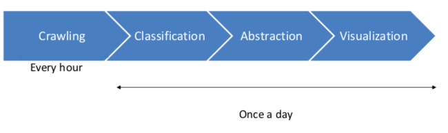

# The Pipeline

This model of the pipeline visualize once more what the steps are. In the following each step is introduced.

1. **Crawling news on a daily basis**

This step is adopted by the tool of the Universtiy of Hamburg Languagte technology group and is called the "News-Crawler"

* In general it downloads URLs of articles on rss-feed input. This will be done hourly by a cronjob.
* The whole article will be downloaded via urls and scrape into elasticsearch. This is done once per day during the night.

So that the output of this first step of the pipeline looks exemplary like this:

`title: “Heisman Watch: Jalen tops Tua in first vote”`

`content: “College football is back, and that means Heisman Watch has begun....”`

`url: “http://www.espn.com/college-football/story/_/page/HeismanWatch190903/heisman-watch- jalen-tops-tua-first-vote”`

This information are stored into ElasticSearch. For further information about the news-crawling tool have a look here - <https://github.com/uhh-lt/news-crawler>

2. **Classification of the articles**

The crawled articles needs to be classified once a day so that the system can diveded them into real and fake news.

For that purpose different classification tools where tried but at the end a benchmark study lead to a proper builded model. The publish paper is called "A Benchmark Study on Machine Learning Methods for Fake News Detection" by Junaed Younus Khan, Md. Tawkat Islam Khondaker, Anindya Iqbal1 and Sadia Afroz and can be find here - <https://arxiv.org/pdf/1905.04749.pdf>

The classifier is trained on the fake_or_real_news dataset by George McIntire. It is a 7.8k news equal allocated dataset which can be downloaded here - <https://opendatascience.com/how-to-build-a-fake-news-classification-model/>

The structure of the dataset is with id, title, text, label similiar to the data which is crawled under the first step. The process is triggered by a cronjob so that at the end of the day the scraped articles with the content are pulled from elasticsearch and are feeded into the model.

The benchmark study suggest a Character-level C-LSTM Model as the best model to build a binary classifier based on the fake_or_real_news dataset. Further characteristics of the model are,

- character level embedding
- two convolutional layers
- bidirectional LSTM recurrent
- dropout / max-pooling
- Sigmoid activation function
- Adam Optimizer

F1-Score = 95%
Accurancy / Preccision / Recal = 95%

The model was trained on a GPU untill it reached comparable results.

**TODO!**
Preprocessing steps

Sometimes articles are crawled with a lower qualitly of content, which means sometimes there isnt even content or the text contains a lot of special characters. Those articles or characters are filtered out by preprocessing steps.

The model returns a value in how confident it is that the given article is either fake or true. Since the visulazition divedes only by true or fake and not take into account how confident the model is, the label is set by the border of 0.5. When the model is more confident then 0.5 it is true news and if it is lower it will be labeled as false. This simplifies the result by a binary result which is wanted.

3. **Extract the main information**

The purpose of providing a quick overview of the articles it needs a special way of representation of the articles. The Content of each article which was labeled before is feeded into a Named Entity Recognition (NER). The spacy framwork provides an english corpus called "en_core_web_sm" which is widely used. In the project context it is used to extract every entity of the content of the article and the starting/ending char.
After extracting each entity are counted in terms of how often they occur in the text. The three most often used entities are selected and saved in elasticsearch.
When this step is finsihed the three most common entites are saved with 15 chars before and after the occurance in the text. So that later in the visulalization tool the occurance can give an first indicator what is the context of that entity.

4. **Visualization**
The generated information needs to be edit that the end-user can get insights. The entites are visualized in a force-directed graph. This graph is catching the eye of the user and increases the user-experince. Each entity is shown as a node and each entity of the same article are connected vie edge.
In general are two graphs visible to represent the difference between the binary classified articles. The nodes can be selected and give further information about the occurance of the entity and lead by further intrest to the origin article.
