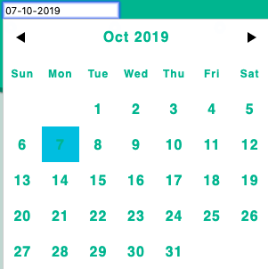
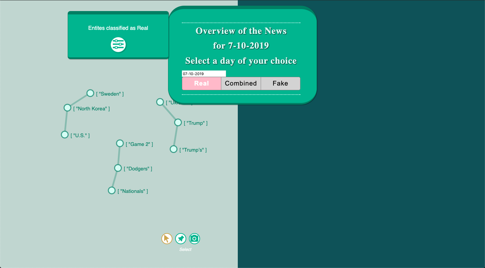
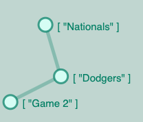
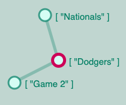
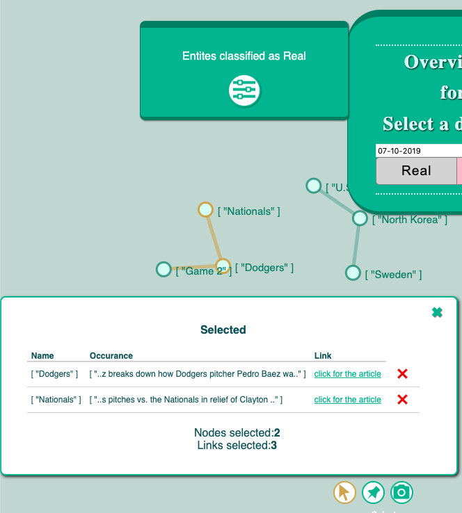
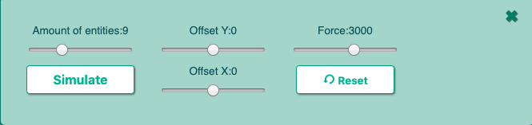

# User Guide for the Website

The successful finished [Pipeline](./PipeLine.md) results in the visualization part which is permanently visible. Which differes with the rest of the pipeline since it is running hourly or daily. The visualization is always visible and reachable but why is it within the pipeline? Since the data is pushed into elasticsearch daily it also can only be retrieved once a day by the frontend.

The basis of this front-end is addapeted by a project of emiliorizzo and his project vue-d3-network. The core of force-directed graphs is used by his project and is customized on the purposes of this porject. The code basis is avaible on GitHub: <https://github.com/emiliorizzo/vue-d3-network>

## DatePicker

The Visualization reprents all the entites which are crawled daily. In the middle of the page is showen which date is selected to represent graphs. This date is customizable and can be edit. Therefor a Datepicker is choosen which can be enabled by clicking on the input field of the date. After choosing a different date, different entities will be loaded.
Warning : so far every date is possible to select but not every date has data. So if a selected date doenst represent entities the data is most probably missing.

## Disable Graphs

The default settings are that the graph for fake and real news are visible at the same time. In that way a comparision might be possible between both graphs. Additional offers this tool to select one graph to focus on it. The tool gives three options *Real*, *Combined* and *Fake*. If the user wants only to see the graph with the real classified entites, the Real button needs to be clicked. To focus on the fake graph the Fake button needs to be selected. It automatically disables the other optioon.

## Graph

As mentioned in the pipeline information the visualization is supposed to show the entities which are created out of the articles. Each entity is represented as one node and has the entity name over it. When the entities are occurane in the same article they are connected with edges.

## Hover feature

The user is able to hover over the edges and the color of the edge will change. This is supposed to improve the clearness in which entities belong to each other.
The nodes changing the color as well when the user hovers over it.

## Selection

When the user selects one node by clicking on it. An additonal pop up appears. The selected node name is visible and context of the word. Currently are n chars before and after the entity occurance within in the article visible. It is supposed to give the user an first idea in which context the entitiy is used. In case the reader is intrested in reading the origin article the click for the article button can be clicked. This button will open an addional tab within the browser with the website of the article.

Furthermore are more than one node selectable. The list can be extended to several entitys. The same pop-up window has the option to deselect the entity again. This function is represented by the red cross. The amount of selected nodes and links are represented below the information. In case more entites are selected as there is space a list will be created so that the user can scroll down to see the other selections.
At the same time as the entity is selected the color of the node is supposed to change to change to be represented as selected node.

The main idea is here to get an intution of the context and how these entites might be related to each other. It directly gives an quick overview about what happened with the entity and also provide the location of the original article.

## Force Directed Graphs

All the nodes, edges and graphs are represented in a force-directed graph. That means the user can select a node and by dragging it around the node moves. Not only the single node is moving also the depending graph moves with it. Since there is force involded each nodes are moving when the nodes get closer to each other. This is an eye catching feature which increases the user-experince.

## Further tools

Since the nodes are freely movable, an feature is added that the nodes can be fixed to a certain point. This feature can be activated by selecting the pin symbol on the right lower corner of the graph. After activating it the user can pin nodes to a fix position. This function disables the selection of the nodes which can be activated again by selecting the arrow symbol next to the pin symbol. The third symbol which is represented as a camera enables the user to take a screenshot of the current graph which can be exported to the disk of the computer.

## Settings

The settings of the graph can be configured. To open the settings section the user need to click on the . Within the setting it is possible to increase or decrease the amount of entities. The slider can be moved in either to the left side which decreases the amount and increase by moving it to the right side. After selecting the simulate button the new entites will be rendered within the graph.
The graph has a center around which the nodes are created. The center can be moved on the Y and X direction. Addional is the amount of force be configurable. The reset button does what the name says it resets the Offset value to 0 again.

