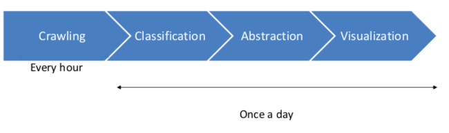

# The Pipeline

This model of the pipeline visualizes again the steps which are performed. In the following, each step is introduced.

1. ## Crawling news on a daily basis

This step is adopted by the tool news-crawler of the University of Hamburg Language technology group and is called the "News-Crawler"

* In general, it downloads URLs of articles on RSS-feed input. This will be done hourly by a cronjob.
* The whole article will be downloaded via URLs and scrape into elastic search. This is done once per day during the night.

So that the output of this first step looks exemplary like this:

`title: “Heisman Watch: Jalen tops Tua in first vote”`
`content: “College football is back, and that means Heisman Watch has begun....”`
`url: “http://www.espn.com/college-football/story/_/page/HeismanWatch190903/heisman-watch- jalen-tops-tua-first-vote”`

This informations are stored in ElasticSearch. For further information about the news-crawling tool have a look here - <https://github.com/uhh-lt/news-crawler>

2. ## Classification of the articles

The crawled articles need to be classified once a day so that the system can divide them into real and fake news.

For that purpose different classification tools where tried but in the end, a benchmark study lead to a properly built model. The published paper is called "A Benchmark Study on Machine Learning Methods for Fake News Detection" by "Junaed Younus Khan, Md. Tawkat Islam Khondaker, Anindya Iqbal1, and Sadia Afroz" and can be found here - <https://arxiv.org/pdf/1905.04749.pdf>

The classifier is trained on the fake_or_real_news dataset by George McIntire. It is a 7.8k news equal allocated dataset which can be downloaded here - <https://opendatascience.com/how-to-build-a-fake-news-classification-model/>

The structure of the dataset is with id, title, text, label similar to the data which is crawled under the first step. The process is triggered by a cronjob so that at the end of the day the scraped articles with the content are pulled from elastic search and are fed into the model.

The benchmark study suggests a Character-level C-LSTM Model as the best model to build a binary classifier based on the fake_or_real_news dataset. Further characteristics of the model are,

- character level embedding
- two convolutional layers
- bidirectional LSTM recurrent
- dropout / max-pooling
- Sigmoid activation function
- Adam Optimizer

F1-Score = 95%
Accurancy / Preccision / Recal = 95%

The model was trained on a GPU until it reached comparable results.

Sometimes articles are crawled with a lower quality of content, which means no content makes sense to a human or the content has several special characters. Those articles or characters are filtered out by preprocessing steps. The model and weights are saved and also provided. 

The model returns a value in how confident it is that the given article is either fake or true. Since the visualization divides only by true or fake and not take into account how confident the model is, the label is set by the border of 0.5. When the model is more confident then 0.5 it is true news and if it is lower it will be labeled as false. This simplifies the result by a binary result that is wanted.

3. ## Extract the main information

The purpose of providing a quick overview of the articles needs a special way of representation of the articles. The content of each article which was labeled before is fed into a Named Entity Recognizer (NER). The spacy framework provides an English corpus called "en_core_web_sm" which is used. In the project context, it is used to extract every entity of the content of the article and the starting/ending char.
After extracting each entity, they are counted in terms of how often they occur in the text. The three most often used entities are selected and saved in elastic search.
When this step is finished the three most common entities are saved with 15 chars before and after the occurrence in the text. So that later in the visualization tool the occurrence can give a first indicator of what is the context of that entity.

4. ## Visualization

The generated information needs to be visualized so the end-user gets insights. The entities are visualized in a force-directed graph. This graph is catching the eye of the user and increases the user-experience. Each entity is shown as a node and each entity of the same article are connected via edge.
Two graphs represent the differences between the binary classified articles. The nodes can be selected and give further information about the occurrence of the entity and lead by further interest to the origin article.

Further information of the front-end can be found [here](./Front-end-user-guide.md)
